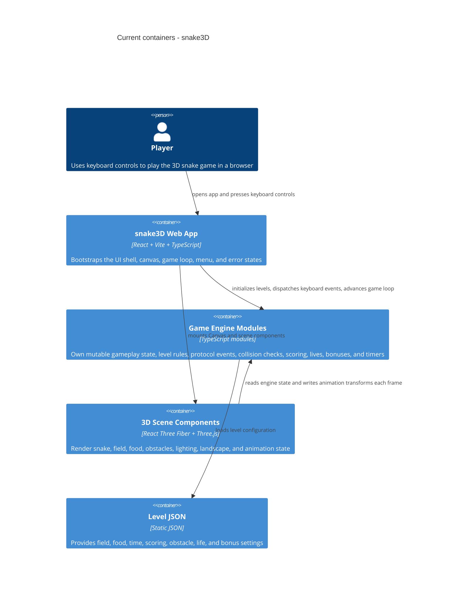

# Architecture map - snake3D

> The current architecture (what exists today), produced by `survey` and read by
> specify / design / data-model / implement. Refresh with `survey` when the repo drifts past
> `reflects_commit`. This is generated; a hand-maintained `docs/architecture.md`, if present, is
> authoritative and reconciled below, not replaced.

## Stack

- Language / runtime: TypeScript with strict compiler settings and React JSX (`tsconfig.json:2`, `tsconfig.json:15`, `tsconfig.json:20`).
- App framework: Vite single-page app with the React plugin (`vite.config.ts:1`, `vite.config.ts:4`).
- 3D rendering: React Three Fiber, Three.js, Drei, Leva, and r3f-perf (`package.json:13`, `package.json:14`, `package.json:16`, `package.json:17`, `package.json:20`).
- UI state: Zustand stores for menu and pause state (`src/store/menuStore.ts:1`, `src/store/menuStore.ts:10`, `src/store/menuStore.ts:20`).
- Build commands: `npm run dev`, `npm run build`, and `npm run preview` (`package.json:6`).
- Test harness: No automated test suite is currently configured in the project.

## C4 - System As It Is

## Module Inventory

| Module         | Path                                                                  | Layers                            | Wired at                                                                               | Responsibility                                                                                                                  |
| -------------- | --------------------------------------------------------------------- | --------------------------------- | -------------------------------------------------------------------------------------- | ------------------------------------------------------------------------------------------------------------------------------- |
| App bootstrap  | `src/main.tsx`                                                        | app shell / initialization        | `src/main.tsx:20`                                                                      | Parses the `level` query parameter, initializes the level, disables scrolling, and renders `Main` or `ErrorScreen`.             |
| UI shell       | `src/components/`                                                     | React UI / R3F rendering          | `src/components/Main.tsx:138`                                                          | Builds the page shell, lazy-loads UI pieces, configures the R3F `Canvas`, and overlays the menu.                                |
| 3D scene       | `src/components/Scene.tsx`, `src/components/Snake.tsx`, `src/assets/` | presentation / animation          | `src/components/Scene.tsx:20`, `src/components/Snake.tsx:22`                           | Renders the field, snake, food, obstacles, landscape, lighting, and custom model geometry.                                      |
| Game engine    | `src/engine/`                                                         | domain / application logic        | `src/engine/time/setLoop.ts:18`, `src/engine/levels/playLevel.ts`                      | Owns gameplay rules, mutable runtime state, timers, movement, collision checks, scoring, lives, bonuses, and level progression. |
| Event protocol | `src/engine/events/`, `src/engine/protocol/`                          | application coordination          | `src/engine/protocol/protocolExecutor.ts:19`, `src/engine/events/keyboardEvents.ts:35` | Converts keyboard and gameplay events into protocol entries and rule handlers.                                                  |
| Configuration  | `src/config/`, `src/engine/levels/*.json`                             | static configuration / level data | `src/config/fieldConfig.ts:3`, `src/engine/levels/loadLevelProps.ts:25`                | Centralizes camera, field, lighting, apple, snake, and per-level parameters.                                                    |
| Types          | `src/types/`                                                          | shared type contracts             | `tsconfig.json:20`                                                                     | Defines typed shapes for engine state, configs, controls, HTML elements, lights, obstacles, protocol events, and snake data.    |
| Commands       | `src/commands/`                                                       | browser utility adapters          | `src/main.tsx:6`, `src/main.tsx:7`                                                     | Encapsulates browser-side helpers such as scroll locking and deterministic random utilities.                                    |
| Styles         | `src/styles/`                                                         | vanilla CSS                       | `src/components/Main.tsx:62`, `src/components/Menu.tsx:3`                              | Provides global layout, menu, wrapper, spinner, and game info CSS.                                                              |

## Conventions (Cited - Rules New Work Must Match)

- **Module wiring / registration:** `src/main.tsx` is the browser entry point; it initializes level state before rendering `Main` (`src/main.tsx:20`, `src/main.tsx:27`, `src/main.tsx:32`). `Main` is the composition root for the canvas, debug monitor, and menu (`src/components/Main.tsx:142`, `src/components/Main.tsx:152`, `src/components/Main.tsx:166`).
- **Game loop:** R3F `useFrame` calls `setLoop(delta)` and `renderInfo()` every frame, with scene teardown keyed off interrupt state (`src/components/Game.tsx:43`, `src/components/Game.tsx:47`, `src/engine/time/setLoop.ts:18`).
- **State model:** Core gameplay uses module-level mutable state plus setter/getter functions, not React state or a central reducer (`src/engine/snake/snake.ts:17`, `src/engine/snake/snake.ts:31`, `src/engine/snake/snake.ts:68`). UI menu/pause state is the exception and uses Zustand (`src/store/menuStore.ts:10`, `src/store/menuStore.ts:20`).
- **Event flow:** Keyboard events produce direction/speed/pause events, then call `protocolExecutor`, which appends to protocol state and switches by event name (`src/engine/events/keyboardEvents.ts:57`, `src/engine/events/keyboardEvents.ts:65`, `src/engine/protocol/protocolExecutor.ts:19`, `src/engine/protocol/protocolExecutor.ts:22`).
- **Rendering pattern:** R3F components read engine/animation getters inside `useFrame` and imperatively update Three refs (`src/components/Snake.tsx:47`, `src/components/Snake.tsx:56`, `src/components/Snake.tsx:59`, `src/components/Scene.tsx:36`, `src/components/Scene.tsx:43`).
- **Error handling:** App startup wraps initialization in `try/catch`, logs initialization errors, renders `ErrorScreen`, and re-enables scrolling (`src/main.tsx:26`, `src/main.tsx:45`, `src/main.tsx:47`, `src/main.tsx:52`). Rule-level events often represent failures as protocol events such as `game over` (`src/engine/events/keyboardEvents.ts:52`, `src/engine/protocol/protocolExecutor.ts:52`).
- **IDs:** There is no persisted identifier strategy. Runtime identity is positional/index-based, for example dynamic snake ref keys like `bodyUnitRef_${index}` (`src/components/Snake.tsx:84`, `src/components/Snake.tsx:145`).
- **Persistence / DB access:** No backend datastore or client persistence exists. Level data is bundled static JSON imported directly into engine modules (`src/engine/levels/loadLevelProps.ts:5`, `src/engine/levels/loadLevelProps.ts:25`).
- **Migrations:** No database migrations are present. Future schema work would need to introduce a migration convention before `data-model` can promote migrations to a live tree.
- **Tests:** No test runner or `tests/` directory is currently present. Verification is limited to TypeScript/build checks through `npm run build` unless a test harness is added (`package.json:6`).
- **Inter-module communication:** Modules communicate by direct imports and shared mutable engine state; there is no HTTP, worker, message bus, or event emitter boundary (`src/engine/levels/loadLevelProps.ts:6`, `src/engine/levels/loadLevelProps.ts:25`, `src/engine/events/allContactEvents.ts:5`, `src/engine/events/allContactEvents.ts:48`).
- **UI / styling:** The app uses vanilla CSS files imported by components, plus some local inline styles for fallback screens (`src/components/Main.tsx:62`, `src/components/Menu.tsx:3`, `src/styles/main.css:7`, `src/components/Main.tsx:89`).

## Datastores

| Store                  | Engine                                | Accessed via                                           | Notes                                                                                                                                                          |
| ---------------------- | ------------------------------------- | ------------------------------------------------------ | -------------------------------------------------------------------------------------------------------------------------------------------------------------- |
| Level definitions      | Static JSON bundled by Vite           | Direct import in `src/engine/levels/loadLevelProps.ts` | Holds per-level field, food, time, scoring, lives, obstacles, and bonuses (`src/engine/levels/loadLevelProps.ts:5`, `src/engine/levels/loadLevelProps.ts:26`). |
| Runtime gameplay state | In-memory TypeScript module variables | Getter/setter functions across `src/engine/`           | Reset and mutation are manual; examples include snake head/body state (`src/engine/snake/snake.ts:17`, `src/engine/snake/snake.ts:21`).                        |
| UI menu/pause state    | In-memory Zustand stores              | `useMenuStore`, `usePauseStore` hooks                  | Limited to overlay visibility/title and pause toggle (`src/store/menuStore.ts:10`, `src/store/menuStore.ts:20`).                                               |

## Frontend / UI Foundation

- **Component library / design system:** No shared UI component library exists. UI is local React components under `src/components/`, with the game view built around R3F `Canvas` (`src/components/Main.tsx:57`, `src/components/Main.tsx:152`).
- **Design tokens:** Tokens are ad hoc CSS values and config constants, not a central token file. Global font/background colors live in `src/styles/main.css` (`src/styles/main.css:7`, `src/styles/main.css:12`, `src/styles/main.css:14`), with scene colors in config such as `fieldConfig.backgroundColor` (`src/config/fieldConfig.ts:3`).
- **Styling approach:** Vanilla CSS imported from components; CSS Modules, Tailwind, styled-components, and a design-system package are not present (`src/components/Main.tsx:62`, `src/components/Menu.tsx:3`).
- **Shared primitives:** No reusable Button/Input/Card/Modal primitives are present. Current UI composition uses feature components such as `Wrapper`, `Menu`, `GameInfo`, `Spinner`, and `ErrorScreen` (`src/components/Main.tsx:64`, `src/components/Main.tsx:67`, `src/components/Main.tsx:68`, `src/components/Main.tsx:69`).
- **State / data-fetching:** Zustand stores local UI state; there is no server cache or data fetching library (`src/store/menuStore.ts:1`, `src/store/menuStore.ts:10`).
- **Closest UI precedent:** A new game screen or overlay should follow `Main` for canvas composition and `Menu` for fixed full-screen overlay behavior (`src/components/Main.tsx:142`, `src/components/Main.tsx:152`, `src/components/Menu.tsx:10`, `src/styles/menu.css:1`).

## Where Things Live / Closest Precedents

- A new gameplay rule or collision behavior -> `src/engine/events/` or the relevant domain folder under `src/engine/`, modelled on the direct-import rule composition in `allContactEvents` (`src/engine/events/allContactEvents.ts:40`, `src/engine/events/allContactEvents.ts:48`).
- A new protocol event -> `src/engine/events/` plus a handler branch in `src/engine/protocol/protocolExecutor.ts`, modelled on `food eaten`, `bonus`, and level/life/game-over events (`src/engine/protocol/protocolExecutor.ts:40`, `src/engine/protocol/protocolExecutor.ts:43`, `src/engine/protocol/protocolExecutor.ts:46`).
- A new rendered entity -> `src/components/` plus `src/assets/` model geometry/config as needed, modelled on `Snake` and scene composition (`src/components/Scene.tsx:61`, `src/components/Scene.tsx:62`, `src/components/Snake.tsx:132`).
- A new level parameter -> `src/engine/levels/*.json` plus loader/setter support in `loadLevelProps`, modelled on field/food/time/obstacle/bonus loading (`src/engine/levels/loadLevelProps.ts:25`, `src/engine/levels/loadLevelProps.ts:36`, `src/engine/levels/loadLevelProps.ts:37`).
- A new automated gameplay check -> first add a test harness and package scripts, then place tests in an agreed project test directory. No `tests/` directory exists today.
- A new screen / UI component -> compose within the existing React/R3F shell, use vanilla CSS in `src/styles/`, and follow `Main`/`Menu` before introducing a new styling approach (`src/components/Main.tsx:142`, `src/components/Menu.tsx:10`, `src/styles/menu.css:1`).

## Constraints & Known Tech-Debt

- The engine relies heavily on module-level mutable state, so tests and new features must account for manual reset/initialization ordering (`src/engine/snake/snake.ts:17`, `src/engine/snake/snake.ts:21`, `src/engine/levels/loadLevelProps.ts:25`).
- Rendering and game-state advancement are coupled to R3F frame callbacks, which makes pure unit testing harder unless engine functions are isolated from frame-owned orchestration (`src/components/Game.tsx:43`, `src/components/Snake.tsx:47`).
- There is no automated test runner or lint script in `package.json`; only dev, build, and preview commands are defined (`package.json:6`).
- `npm run build` passes as of 2026-07-14. Manual vendor chunks reduced the previous largest chunks to one remaining `three-vendor` chunk of approximately `690 kB`; Vite still reports that size warning and a dependency warning about `eval` usage in `three-stdlib/libs/lottie.js`.
- Runtime HTTP smoke checks pass as of 2026-07-14 for both `npm run dev -- --host 127.0.0.1 --port 5174` and `npm run preview -- --host 127.0.0.1 --port 4173`. User-provided manual testing on 2026-07-15 confirms the core gameplay path; invalid-level and bonus edge cases remain follow-up checks because no browser automation suite is configured.
- Generated outputs and dependencies such as `dist/` and `node_modules/`, when present, should not be treated as source architecture.
- Several source comments contain mojibake from non-UTF-8 text, while the codebase otherwise uses TypeScript/JSX syntax and English identifiers (`src/main.tsx:9`, `src/components/Main.tsx:71`).
- `README.md` now describes the actual Snake 3D project, but should stay synchronized with commands, validation rules, and documentation layout (`README.md:1`).
- No authored architecture document was found; this generated map is the current SDD architecture reference.

## Reconciliation With The Authored Architecture Doc

No authored architecture doc was found (`docs/architecture.md`, `ARCHITECTURE.md`, root `CLAUDE.md`, or ADRs). This map is therefore the current reference for downstream SDD stages.
